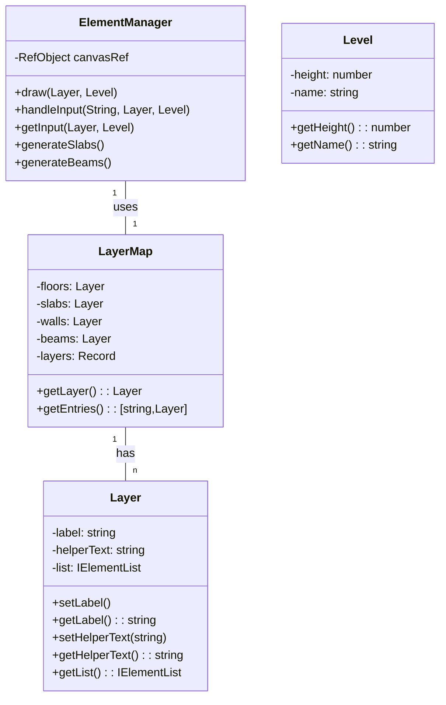

# Structural Drawing Project

This project is a simple web application that allows users to draw slabs and generate corresponding beams on an HTML canvas.

## Features

- ✅ Input slabs via textarea
- ✅ Draw slabs on a canvas
- ✅ Implement floor levels
- ✅ Implement beams and generate them from floors
- ✅ Implement walls and generate them from floors and walls
- ✅ Define and draw beam intersections
- ✅ Implement superficial loads linked to slabs
- ✅ Zoom and centralize drawing on canvas
- ✅ Implement linear loads
- ✅ Implement punctual loads
- ✅ Implement columns and generate them from beams
- ❌ Copy elements for all floors
- ❌ Exhibit many layers at once
- ❌ Implement room uses
- ❌ Implement iElement weights
- ❌ Implement iElement dimensions
- ❌ Implement sublayers
- ❌ Implement beam sections and supports
- ❌ Draw elements in Three.js
- ❌ Add overlapping verification for iElements implementations
- ❌ Calculate effects their distributions
- ❌ Design and calculate structural pieces
- ❌ Implement foundations and generate them from columns
- ❌ Implement stairs

## Technologies Used

- React
- TypeScript
- HTML5 Canvas

## Class Diagram

----------

# Projeto de Desenho Estrutural

Este projeto é uma aplicação web simples que permite aos usuários desenharem lajes e gerarem vigas correspondentes em um canvas HTML.

## Funcionalidades

- Entrada de lajes via textarea.
- Desenho das lajes em um canvas.
- Geração de vigas a partir das lajes e exibição em um segundo textarea. 

## Tecnologias Utilizadas 

- React 
- TypeScript 
- HTML5 Canvas